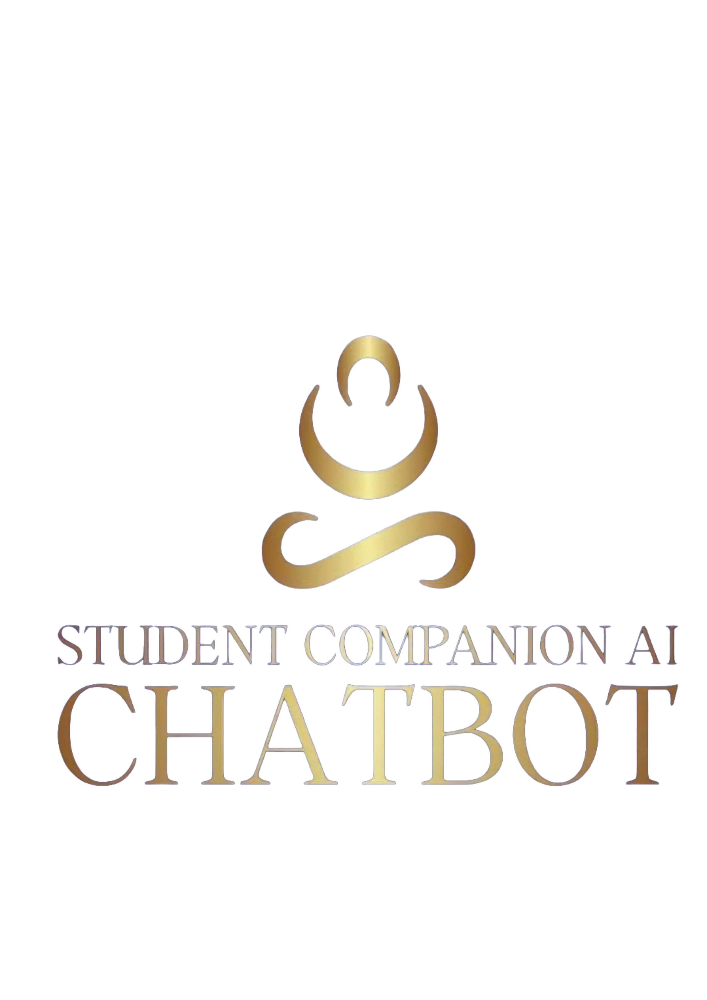

<p align="center">
  
</p>

<h1 align="center">Student Companion AI</h1>
<h3 align="center">CHATBOT</h3>

<p align="center">
  <strong>Your AI-Powered Academic Partner at African Leadership University</strong>
</p>

<p align="center">
  <a href="#features">Features</a> •
  <a href="#demo">Live Demo</a> •
  <a href="#tech-stack">Tech Stack</a> •
  <a href="#getting-started">Getting Started</a> •
  <a href="#roadmap">Roadmap</a> •
  <a href="#contact">Contact</a>
</p>

<p align="center">
  
  
  
  
  
</p>

---

## 🎯 Overview

**Student Companion AI** is a comprehensive AI-powered chatbot platform designed exclusively for African Leadership University students. It serves as your 24/7 academic assistant, providing instant answers to questions about admissions, scholarships, programs, visa applications, campus life, and more.

Our mission is to enhance the student experience by providing immediate access to information, resources, and support - empowering the next generation of African leaders to focus on what matters most: their education and growth.

<p align="center">
  
  <br>
  <em>Clean, intuitive chat interface with AI-powered responses and opportunities panel</em>
</p>

---

## ✨ Features

### 🤖 AI-Powered Chat Assistant
- **Instant Answers**: Get immediate responses to questions about ALU policies, programs, and procedures
- **Smart Search**: Deep integration with ALU Help Center for accurate, up-to-date information
- **Natural Conversations**: Chat naturally - our AI understands context and provides helpful responses
- **24/7 Availability**: Access support anytime, anywhere
- **Quick Actions**: Direct links to important resources like Admissions Portal

### 📚 Academic Support
- **Program Information**: Detailed information about undergraduate and postgraduate programs
- **Course Registration Help**: Step-by-step guidance for registration processes
- **Library Resources**: Quick access to digital library, databases, and research materials
- **Academic Calendar**: Stay updated on important dates and deadlines
- **Visa Application Guidance**: Complete steps for international student visas

### 💰 Financial Aid & Scholarships
- **Scholarship Information**: Learn about merit-based, need-based, and regional scholarships
- **Application Guidance**: Step-by-step scholarship application process
- **Tuition Details**: Clear breakdown of fees and payment options
- **Financial Aid Support**: Connect with the financial aid office

### 🎯 Career Services & Opportunities
- **Internship Opportunities**: Browse 200+ partner organizations
- **Job Listings**: Access to jobs, grants, and research opportunities
- **Career Guidance**: Resume tips, interview preparation, and job search strategies
- **Alumni Network**: Connect with 5,000+ ALU alumni worldwide
- **Industry Connections**: Access to top tech companies, consulting firms, and NGOs
- **Real-time Updates**: 12+ opportunities updated daily

### 👥 Faculty & Staff Directory
- **Quick Contact**: Find professor contact information instantly
- **Office Hours**: Book appointments with faculty members
- **Department Information**: Navigate university departments easily
- **University Admin Support**: Direct access to administrative help

### 🏥 Student Wellness
- **Mental Health Resources**: Confidential counseling services information
- **Wellness Center**: Access to on-campus health services
- **Support Groups**: Information about peer support and community resources

### 🔐 Secure Authentication
- **Google Sign-In**: Quick and secure authentication
- **ALU Email Integration**: Seamless login with your @alustudent.com email
- **Privacy First**: Your conversations are private and secure

### 🎨 Beautiful User Experience
- **Interactive Demo**: Try the chatbot before signing up
- **Dark Mode Interface**: Easy on the eyes for late-night studying
- **Responsive Design**: Works perfectly on desktop, tablet, and mobile
- **Opportunities Panel**: Browse grants, internships, and jobs alongside chat

---

## 🖼️ Screenshots

<p align="center">
  
  <br>
  <em>Interactive demo on the login page - try before you sign up!</em>
</p>

<p align="center">
  
  <br>
  <em>Get detailed guidance on visa applications and other processes</em>
</p>

---

## 🚀 Coming Soon

<table>
  <tr>
    <td align="center" width="33%">
      <h3>📅</h3>
      <strong>Google Calendar Integration</strong>
      <br><br>
      <em>Sync your academic schedule, get smart reminders, and never miss a deadline. Your classes, assignments, and exams all in one place.</em>
    </td>
    <td align="center" width="33%">
      <h3>📚</h3>
      <strong>Canvas LMS Integration</strong>
      <br><br>
      <em>View assignments, check grades, and track submissions directly in chat. No more switching between apps.</em>
    </td>
    <td align="center" width="33%">
      <h3>🔔</h3>
      <strong>Smart Notifications</strong>
      <br><br>
      <em>Personalized alerts for deadlines, events, scholarship opportunities, and important announcements.</em>
    </td>
  </tr>
  <tr>
    <td align="center" width="33%">
      <h3>👥</h3>
      <strong>Study Groups</strong>
      <br><br>
      <em>Find and connect with study partners in your courses. Collaborate, share notes, and succeed together.</em>
    </td>
    <td align="center" width="33%">
      <h3>🌍</h3>
      <strong>Multi-Language Support</strong>
      <br><br>
      <em>Chat in French, Swahili, Kinyarwanda, and other African languages. Education without language barriers.</em>
    </td>
    <td align="center" width="33%">
      <h3>📱</h3>
      <strong>Mobile App</strong>
      <br><br>
      <em>Native iOS and Android apps for on-the-go access. Your academic companion in your pocket.</em>
    </td>
  </tr>
</table>

---

## 🛠️ Tech Stack

### Frontend
| Technology | Purpose |
|------------|---------|
| **React 18** | Modern UI library with hooks |
| **TypeScript** | Type-safe development |
| **Tailwind CSS** | Utility-first styling |
| **Shadcn/UI** | Beautiful, accessible components |
| **Vite** | Lightning-fast build tool |
| **React Router** | Client-side routing |

### Backend & AI
| Technology | Purpose |
|------------|---------|
| **Hugging Face Spaces** | AI model hosting |
| **Custom Knowledge Base** | ALU-specific information |
| **Firebase** | Authentication & real-time database |
| **REST APIs** | Backend communication |

### Authentication
| Technology | Purpose |
|------------|---------|
| **Firebase Auth** | Secure authentication |
| **Google OAuth 2.0** | Social login |
| **ALU Email Verification** | Domain-restricted access |

### Deployment
| Technology | Purpose |
|------------|---------|
| **Vercel** | Frontend hosting |
| **Hugging Face** | AI backend |
| **GitHub Actions** | CI/CD pipeline |

---

## 🏃 Getting Started

### Prerequisites

- Node.js 18+ 
- npm or yarn
- Firebase account
- Git

### Installation

1. **Clone the repository**
   ```bash
   git clone https://github.com/Donne120/Student_companion.git
   cd Student_companion
   ```

2. **Install dependencies**
   ```bash
   npm install
   ```

3. **Set up environment variables**
   
   Create a `.env` file in the root directory:
   ```env
   VITE_FIREBASE_API_KEY=your_firebase_api_key
   VITE_FIREBASE_AUTH_DOMAIN=your_project.firebaseapp.com
   VITE_FIREBASE_PROJECT_ID=your_project_id
   VITE_FIREBASE_STORAGE_BUCKET=your_project.appspot.com
   VITE_FIREBASE_MESSAGING_SENDER_ID=your_sender_id
   VITE_FIREBASE_APP_ID=your_app_id
   ```

4. **Start the development server**
   ```bash
   npm run dev
   ```

5. **Open your browser**
   
   Navigate to `http://localhost:3000`

### Building for Production

```bash
npm run build
```

The built files will be in the `dist` directory.

---

## 📁 Project Structure

```
student-companion-ai/
├── public/
│   ├── logo.png              # Student Companion AI logo
│   └── favicon.ico           # Browser favicon
├── src/
│   ├── components/           # Reusable UI components
│   │   ├── chat/            # Chat-related components
│   │   ├── ui/              # Shadcn UI components
│   │   └── mini-chatbot/    # Floating chatbot widget
│   ├── contexts/            # React contexts (Auth, Theme)
│   ├── hooks/               # Custom React hooks
│   ├── lib/                 # Utilities and configurations
│   │   └── firebase.ts      # Firebase configuration
│   ├── pages/               # Page components
│   │   ├── Login.tsx        # Login page with demo
│   │   ├── Signup.tsx       # Signup page with demo
│   │   └── Chat.tsx         # Main chat interface
│   ├── services/            # API and service functions
│   │   ├── aiService.ts     # AI chat service
│   │   └── helpCenterService.ts  # Help center integration
│   ├── types/               # TypeScript type definitions
│   ├── utils/               # Utility functions
│   ├── App.tsx              # Main application component
│   ├── main.tsx             # Application entry point
│   └── index.css            # Global styles
├── docs/
│   └── screenshots/         # App screenshots
├── .env                     # Environment variables
├── package.json             # Dependencies and scripts
├── tailwind.config.js       # Tailwind CSS configuration
├── tsconfig.json            # TypeScript configuration
└── vite.config.ts           # Vite configuration
```

---

## 🗺️ Roadmap

### Phase 1: Foundation ✅ Complete
- [x] AI-powered chat interface
- [x] Firebase authentication
- [x] Google Sign-In integration
- [x] ALU Help Center integration
- [x] Responsive design
- [x] Interactive demo on auth pages
- [x] Opportunities panel (Jobs, Grants, Internships)
- [x] Quick Actions with resource links
- [x] University Admin support widget

### Phase 2: Enhanced Features (Q1 2025)
- [ ] Google Calendar integration
- [ ] Canvas LMS integration
- [ ] Push notifications
- [ ] Offline support (PWA)
- [ ] Voice input support

### Phase 3: Community Features (Q2 2025)
- [ ] Study group finder
- [ ] Peer tutoring connections
- [ ] Event discovery & RSVP
- [ ] Alumni mentorship matching
- [ ] Discussion forums

### Phase 4: Advanced AI (Q3 2025)
- [ ] Personalized learning recommendations
- [ ] Academic performance insights
- [ ] Career path suggestions
- [ ] Multi-language support (French, Swahili, Kinyarwanda)
- [ ] Document analysis (transcripts, syllabi)

### Phase 5: Mobile Apps (Q4 2025)
- [ ] iOS native app
- [ ] Android native app
- [ ] Cross-platform sync
- [ ] Voice assistant integration
- [ ] Widget support

---

## 🤝 Contributing

We welcome contributions from the ALU community and beyond! Here's how you can help:

### Ways to Contribute

| Type | Description |
|------|-------------|
| 🐛 **Report Bugs** | Found a bug? Open an issue with details |
| 💡 **Suggest Features** | Have an idea? We'd love to hear it |
| 🔧 **Submit PRs** | Code contributions are always welcome |
| 📝 **Improve Docs** | Help us make documentation better |
| 🌟 **Spread the Word** | Tell other students about the platform |

### Development Guidelines

1. Fork the repository
2. Create a feature branch (`git checkout -b feature/amazing-feature`)
3. Commit your changes (`git commit -m 'Add amazing feature'`)
4. Push to the branch (`git push origin feature/amazing-feature`)
5. Open a Pull Request

### Code Style

- Use TypeScript for type safety
- Follow ESLint configuration
- Write meaningful commit messages
- Add comments for complex logic
- Test your changes thoroughly

---

## 📄 License

This project is licensed under the MIT License - see the [LICENSE](LICENSE) file for details.

---

## 🙏 Acknowledgments

- **African Leadership University** - For inspiring this project and the mission to develop African leaders
- **ALU Students** - For feedback, feature suggestions, and being our motivation
- **Open Source Community** - For the amazing tools and libraries that make this possible

---

## 📞 Contact & Support

<p align="center">
  
</p>

<p align="center">
  <strong>Student Companion AI</strong>
  <br>
  <em>Your 24/7 Academic Partner</em>
</p>

<p align="center">
  <a href="mailto:studentcompanionai@gmail.com">
    
  </a>
</p>

<p align="center">
  <a href="https://github.com/Donne120/Student_companion">
    
  </a>
  <a href="https://github.com/Donne120/Student_companion/issues">
    
  </a>
</p>

### Get In Touch

| Channel | Contact |
|---------|---------|
| 📧 **Email** | studentcompanionai@gmail.com |
| 🐙 **GitHub** | [@Donne120](https://github.com/Donne120) |
| 🐛 **Bug Reports** | [GitHub Issues](https://github.com/Donne120/Student_companion/issues) |
| 💡 **Feature Requests** | [GitHub Discussions](https://github.com/Donne120/Student_companion/discussions) |

---

<p align="center">
  
</p>

<p align="center">
  <strong>Built with ❤️ for African Students</strong>
  <br>
  <em>Empowering the next generation of African leaders</em>
</p>

<p align="center">
  <sub>© 2024 Student Companion AI. All rights reserved.</sub>
</p>
