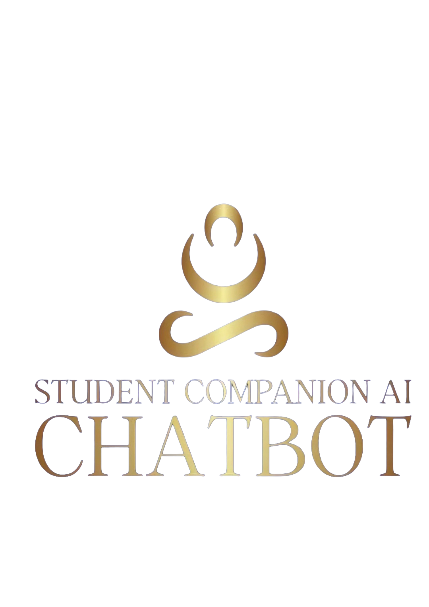

# 🎓 Student Companion AI

<div align="center">



### Your AI-Powered Guide Through the ALU Journey

[](https://student-companion-cyan.vercel.app)
[](https://aws.amazon.com)
[](https://anthropic.com)
[](LICENSE)

[Live Demo](https://student-companion-cyan.vercel.app) • [Documentation](#documentation) • [Contact](#contact)

</div>

---

## 🌟 Overview

**Student Companion AI** is an intelligent chatbot designed specifically for African Leadership University (ALU) students. It provides instant, accurate answers to questions about admissions, academics, wellness services, campus life, and more.

### Why Student Companion?

- 📚 **24/7 Availability** - Get answers anytime, anywhere
- 🎯 **ALU-Specific Knowledge** - Trained on official ALU information
- 🔒 **Secure & Private** - Enterprise-grade AWS infrastructure
- 🌍 **Built for Africa** - Designed with African students in mind

---

## ✨ Features

### 🤖 AI-Powered Chat
- Natural language understanding with Claude 3.7 Sonnet
- Context-aware responses using RAG (Retrieval Augmented Generation)
- Conversation history and memory

### 📖 Knowledge Base
- **Admissions** - Requirements, deadlines, application process
- **Academics** - Programs, courses, grading policies
- **Wellness** - Counseling services, health insurance, pharmacy directory
- **Campus** - Facilities, housing, student services
- **Policies** - Code of conduct, attendance, housing rules

### 🔐 Authentication
- Google Sign-in
- Email/Password authentication
- Secure session management

### 📱 Modern UI
- Beautiful, responsive design
- Dark/Light mode support
- Mobile-optimized experience
- Interactive demo on login page

---

## 🏗️ Architecture

```
┌─────────────────────────────────────────────────────────────────┐
│                    STUDENT COMPANION AI                          │
├─────────────────────────────────────────────────────────────────┤
│                                                                  │
│   FRONTEND (Vercel)              BACKEND (AWS)                  │
│   ┌──────────────┐               ┌──────────────┐               │
│   │    React     │───────────────│ API Gateway  │               │
│   │   + Vite     │               │   + Lambda   │               │
│   │  + Tailwind  │               └──────┬───────┘               │
│   └──────────────┘                      │                       │
│                                         ▼                       │
│                              ┌──────────────────┐               │
│                              │  Amazon Bedrock  │               │
│                              │  (Claude 3.7)    │               │
│                              └────────┬─────────┘               │
│                                       │                         │
│                    ┌──────────────────┼──────────────────┐      │
│                    ▼                  ▼                  ▼      │
│             ┌──────────┐       ┌──────────┐       ┌──────────┐ │
│             │ DynamoDB │       │OpenSearch│       │    S3    │ │
│             │  (Data)  │       │  (RAG)   │       │  (Docs)  │ │
│             └──────────┘       └──────────┘       └──────────┘ │
│                                                                  │
└─────────────────────────────────────────────────────────────────┘
```

---

## 🛠️ Tech Stack

### Frontend
- **React 18** - UI framework
- **TypeScript** - Type safety
- **Vite** - Build tool
- **Tailwind CSS** - Styling
- **shadcn/ui** - Component library
- **Firebase** - Authentication

### Backend
- **Python 3.11** - Runtime
- **FastAPI** - Web framework
- **AWS Lambda** - Serverless compute
- **Amazon Bedrock** - AI (Claude 3.7 Sonnet)
- **DynamoDB** - Database
- **OpenSearch** - Vector search (RAG)
- **S3** - Document storage

### Infrastructure
- **AWS SAM** - Infrastructure as Code
- **CloudFormation** - Resource management
- **API Gateway** - API management
- **CloudWatch** - Monitoring

---

## 🚀 Getting Started

### Prerequisites

- Node.js 18+
- Python 3.11+
- AWS CLI configured
- AWS SAM CLI

### Frontend Setup

```bash
cd frontend
npm install
npm run dev
```

### Backend Setup

```bash
cd backend
pip install -r requirements.txt

# Local development
uvicorn src.main:app --reload

# Or with Docker
docker-compose up
```

### Deploy to AWS

```bash
cd backend
sam build
sam deploy --guided
```

---

## 📁 Project Structure

```
student-companion/
├── frontend/                 # React frontend
│   ├── src/
│   │   ├── components/       # UI components
│   │   ├── pages/            # Page components
│   │   ├── services/         # API services
│   │   └── contexts/         # React contexts
│   └── public/               # Static assets
│
├── backend/                  # AWS backend
│   ├── src/
│   │   ├── handlers/         # Lambda handlers
│   │   ├── services/         # Business logic
│   │   ├── models/           # Data models
│   │   ├── knowledge_base/   # ALU knowledge
│   │   └── utils/            # Utilities
│   ├── infrastructure/       # SAM templates
│   └── scripts/              # Deployment scripts
│
└── README.md
```

---

## 🔮 Coming Soon

### 📅 Google Calendar Integration
- Sync academic calendar
- Assignment reminders
- Event notifications
- Class schedule management

### 📚 Canvas LMS Integration
- Course information sync
- Assignment tracking
- Grade notifications
- Direct course access

---

## 🤝 Partners

<div align="center">

**Powered by CloudPlexo** - AWS Advanced Partner

Up to $100,000 in AWS credits for startups

</div>

---

## 📞 Contact

- **Email:** studentcompanionai@gmail.com
- **Demo:** [student-companion-cyan.vercel.app](https://student-companion-cyan.vercel.app)
- **GitHub:** [Student Companion Repository](https://github.com/Donne120/Student_companion)

---

## 📄 License

This project is licensed under the MIT License - see the [LICENSE](LICENSE) file for details.

---

<div align="center">

**Built with ❤️ for ALU Students**

*Empowering the next generation of African leaders*

</div>
